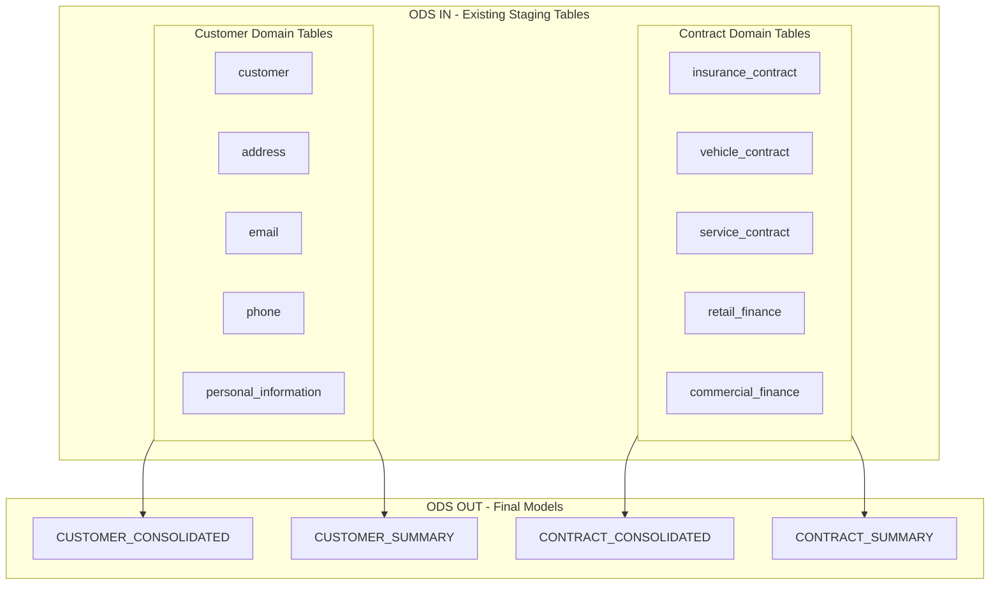
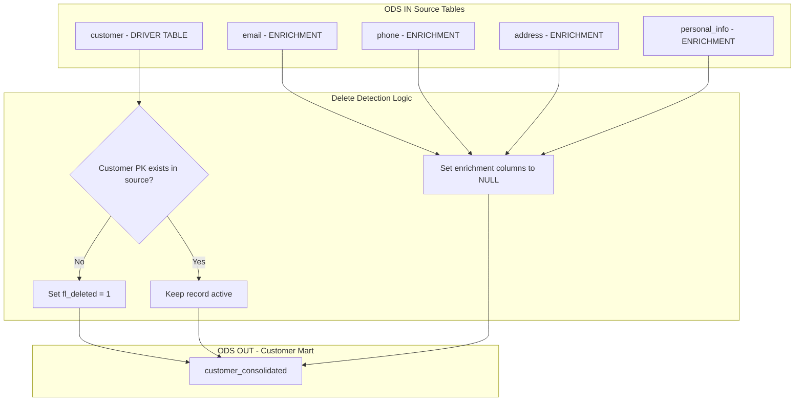
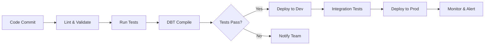

# ODS_DK_DBT Architecture Plan

## Executive Summary

This document outlines the architecture for the ODS DK (Operational Data Store Denmark) DBT data platform. The project is designed specifically for the Denmark market with a focus on simplicity and maintainability.

## Project Overview

### Business Context
- **Source System**: ODS IN (existing staging tables in Snowflake)
- **Target System**: ODS OUT with 4 final models
- **Transformation**: SCD Type 1 (overwrite) with soft delete handling
- **Processing**: Daily ETL pipeline at 6 AM UTC
- **Platform**: Snowflake data warehouse

### Data Flow Overview



### Key Design Decisions

1. **Single Market Focus**: DK (Denmark) only
2. **SCD Type 1**: Overwrite strategy for all tables (no historical tracking)
3. **No Intermediate Layer**: Direct transformation from ODS IN staging to ODS OUT marts
4. **4 Output Models**: 
   - CUSTOMER_CONSOLIDATED (joined from customer, address, email, phone, personal_information)
   - CUSTOMER_SUMMARY (aggregated customer metrics)
   - CONTRACT_CONSOLIDATED (joined from insurance, vehicle, service, retail_finance, commercial_finance)
   - CONTRACT_SUMMARY (aggregated contract metrics)

## Architecture Principles

### 1. Configuration-Driven Design
All table mappings, transformations, and business rules are defined in YAML configuration files, enabling:
- Clear separation of configuration and logic
- Minimal code changes for new table additions

### 2. Layered Architecture
Following DBT best practices with three distinct layers:

| Layer | Purpose | Naming Convention |
|-------|---------|-------------------|
| Staging | Source data selection, renaming, type casting | `stg_<source>_<entity>` |
| Intermediate | Business logic, joins, transformations | `int_<domain>_<entity>` |
| Mart | Final business-ready tables | `<domain>_<entity>` |

### 3. Reusable Components
- Generic macros for common transformations
- Modular design patterns

## Project Directory Structure

```
ods_dk_dbt/
├── dbt_project/
│   ├── dbt_project.yml
│   ├── profiles.yml
│   ├── packages.yml                  # dbt-utils package
│   ├── models/
│   │   ├── sources/                  # Source definitions organized by domain
│   │   │   ├── _sources.yml          # Main source config (database, schema)
│   │   │   ├── customer_sources.yml  # Customer domain tables
│   │   │   └── contract_sources.yml  # Contract domain tables
│   │   └── marts/
│   │       ├── customer/
│   │       │   ├── _mart_customer__models.yml
│   │       │   ├── customer_consolidated.sql
│   │       │   └── customer_summary.sql
│   │       └── contract/
│   │           ├── _mart_contract__models.yml
│   │           ├── contract_consolidated.sql
│   │           └── contract_summary.sql
│   ├── macros/
│   │   └── scd/                      # SCD and delete detection macros
│   └── tests/
│       └── generic/
├── config/
│   └── markets/
│       └── dk.yaml                   # Denmark market configuration
├── scripts/
│   ├── setup_environment.sh
│   ├── run_dbt.sh
│   └── deploy.sh
├── plans/
│   └── architecture_plan.md
├── .gitignore
├── README.md
└── requirements.txt
```

## DBT Best Practices for Large Projects

### Source Organization

For projects with many source tables, DBT recommends organizing sources by **domain** rather than individual files per table:

```yaml
# models/sources/_sources.yml - Main source configuration
version: 2

sources:
  - name: ods_in
    description: "ODS IN staging database"
    database: "ODS_DK_IN"
    schema: "STAGING"
    loader: "Fivetran/Snowflake"
    
    # Default freshness for all tables
    loaded_at_field: "loaded_at"
    freshness:
      warn_after: {count: 12, period: hour}
      error_after: {count: 24, period: hour}
```

```yaml
# models/sources/customer_sources.yml - Customer domain tables
version: 2

sources:
  - name: ods_in_customer
    description: "Customer domain tables from ODS IN"
    database: "ODS_DK_IN"
    schema: "STAGING"
    
    tables:
      - name: customer
        description: "Core customer data"
        columns:
          - name: pk_hash
            description: "Primary key hash - surrogate key"
            tests:
              - unique
              - not_null
          - name: row_hash
            description: "Row hash for change detection"
          - name: customer_id
            description: "Business key for customer"
          - name: customer_name
          - name: customer_type
          - name: registration_date
          - name: status
          - name: fl_deleted
            description: "Soft delete flag"
          - name: loaded_at
            description: "Load timestamp"
            
      - name: address
        description: "Customer address information"
        columns:
          - name: pk_hash
            description: "Primary key hash"
            tests:
              - unique
              - not_null
          - name: row_hash
            description: "Row hash for change detection"
          - name: address_id
          - name: customer_id
          - name: address_type
          - name: street_address
          - name: city
          - name: postal_code
          - name: country
          - name: is_primary
          - name: is_active
          - name: fl_deleted
          - name: loaded_at
            
      - name: email
        description: "Customer email addresses"
        columns:
          - name: pk_hash
            tests: [unique, not_null]
          - name: row_hash
          - name: email_id
          - name: customer_id
          - name: email_address
          - name: email_type
          - name: is_primary
          - name: is_active
          - name: fl_deleted
          - name: loaded_at
            
      - name: phone
        description: "Customer phone numbers"
        columns:
          - name: pk_hash
            tests: [unique, not_null]
          - name: row_hash
          - name: phone_id
          - name: customer_id
          - name: phone_number
          - name: phone_type
          - name: is_primary
          - name: is_active
          - name: fl_deleted
          - name: loaded_at
            
      - name: personal_information
        description: "Customer personal details"
        columns:
          - name: pk_hash
            tests: [unique, not_null]
          - name: row_hash
          - name: customer_id
          - name: date_of_birth
          - name: national_id
          - name: gender
          - name: fl_deleted
          - name: loaded_at
```

```yaml
# models/sources/contract_sources.yml - Contract domain tables
version: 2

sources:
  - name: ods_in_contract
    description: "Contract domain tables from ODS IN"
    database: "ODS_DK_IN"
    schema: "STAGING"
    
    tables:
      - name: insurance_contract
        description: "Insurance contract data"
        columns:
          - name: pk_hash
            description: "Primary key hash"
            tests: [unique, not_null]
          - name: row_hash
            description: "Row hash for change detection"
          - name: contract_id
          - name: customer_id
          - name: contract_start_date
          - name: contract_end_date
          - name: contract_value
          - name: premium_amount
          - name: coverage_type
          - name: status
          - name: fl_deleted
          - name: loaded_at
            
      - name: vehicle_contract
        description: "Vehicle contract data"
        columns:
          - name: pk_hash
            tests: [unique, not_null]
          - name: row_hash
          - name: contract_id
          - name: customer_id
          - name: contract_start_date
          - name: contract_end_date
          - name: contract_value
          - name: monthly_payment
          - name: vehicle_type
          - name: status
          - name: fl_deleted
          - name: loaded_at
            
      - name: service_contract
        description: "Service contract data"
        columns:
          - name: pk_hash
            tests: [unique, not_null]
          - name: row_hash
          - name: contract_id
          - name: customer_id
          - name: contract_start_date
          - name: contract_end_date
          - name: contract_value
          - name: service_fee
          - name: service_type
          - name: status
          - name: fl_deleted
          - name: loaded_at
            
      - name: retail_finance
        description: "Retail finance contract data"
        columns:
          - name: pk_hash
            tests: [unique, not_null]
          - name: row_hash
          - name: contract_id
          - name: customer_id
          - name: contract_start_date
          - name: contract_end_date
          - name: contract_value
          - name: interest_rate
          - name: loan_term_months
          - name: status
          - name: fl_deleted
          - name: loaded_at
            
      - name: commercial_finance
        description: "Commercial finance contract data"
        columns:
          - name: pk_hash
            tests: [unique, not_null]
          - name: row_hash
          - name: contract_id
          - name: customer_id
          - name: contract_start_date
          - name: contract_end_date
          - name: contract_value
          - name: interest_rate
          - name: facility_limit
          - name: status
          - name: fl_deleted
          - name: loaded_at
```

### Hash-Based SCD Type 1 Pattern with Smart Soft Delete

**Key Principle: Delete Only Based on Primary Driver Table**

The soft delete logic should ONLY trigger when the **primary key from the main driver table** is missing from source. Enrichment tables (email, phone, address) are joined with LEFT JOIN, so missing data there should NOT trigger deletion.

**Delete Logic Rules:**

| Scenario | Action |
|----------|--------|
| Customer record missing from source | `fl_deleted = 1` (soft delete) |
| Email data missing from source | Keep customer, email columns = NULL |
| Phone data missing from source | Keep customer, phone columns = NULL |
| Address data missing from source | Keep customer, address columns = NULL |
| Customer has `fl_deleted = 1` in source | `fl_deleted = 1` in mart |

**Architecture Pattern:**



**Hard Delete Detection Macro (Driver Table Only):**

```sql
-- macros/scd/hard_delete_detection.sql

    {{ return(adapter.dispatch('handle_hard_deletes', 'ods_dk_dbt')(target_table, driver_source, pk_column)) }}



    
    -- Only mark as deleted if PRIMARY KEY is missing from DRIVER table
    -- Missing enrichment data (email, phone, etc.) does NOT trigger deletion
    UPDATE {{ target_table }}
    SET 
        fl_deleted = 1,
        deleted_at = {{ dbt_utils.current_timestamp() }}
    WHERE {{ pk_column }} NOT IN (
        SELECT {{ pk_column }} FROM {{ driver_source }}
    )
    AND fl_deleted = 0;
    

```

**Complete Customer Mart Model:**

```sql
-- models/marts/customer/customer_consolidated.sql
{{ config(
    materialized='incremental',
    unique_key='pk_hash',
    cluster_by=['customer_id'],
    tags=['mart', 'customer', 'final'],
    -- Only check DRIVER table (customer) for deletes
    post_hook="{{ handle_hard_deletes(this, ref('customer_driver'), 'pk_hash') }}"
) }}

-- DRIVER TABLE: customer (determines existence)
WITH customer_driver AS (
    SELECT 
        pk_hash,
        row_hash,
        customer_id,
        customer_name,
        customer_type,
        registration_date,
        status,
        COALESCE(fl_deleted, 0) AS fl_deleted,
        loaded_at
    FROM {{ source('ods_in_customer', 'customer') }}
),

-- ENRICHMENT TABLES: LEFT JOINed (missing data = NULL, NOT deletion)
address AS (
    SELECT 
        customer_id,
        address_type,
        street_address,
        city,
        postal_code,
        country,
        ROW_NUMBER() OVER (PARTITION BY customer_id ORDER BY is_primary DESC) AS addr_rank
    FROM {{ source('ods_in_customer', 'address') }}
    WHERE is_active = TRUE
),

email AS (
    SELECT 
        customer_id,
        email_address,
        email_type,
        ROW_NUMBER() OVER (PARTITION BY customer_id ORDER BY is_primary DESC) AS email_rank
    FROM {{ source('ods_in_customer', 'email') }}
    WHERE is_active = TRUE
),

phone AS (
    SELECT 
        customer_id,
        phone_number,
        phone_type,
        ROW_NUMBER() OVER (PARTITION BY customer_id ORDER BY is_primary DESC) AS phone_rank
    FROM {{ source('ods_in_customer', 'phone') }}
    WHERE is_active = TRUE
),

personal_info AS (
    SELECT * FROM {{ source('ods_in_customer', 'personal_information') }}
),

final AS (
    SELECT
        -- Primary key from DRIVER table
        c.pk_hash,
        -- Row hash for change detection
        {{ dbt_utils.generate_surrogate_key([
            'c.customer_id', 'c.customer_name', 'c.customer_type',
            'c.registration_date', 'c.status', 'a.street_address',
            'a.city', 'a.postal_code', 'a.country', 'e.email_address',
            'p.phone_number', 'pi.date_of_birth', 'pi.national_id', 'pi.gender'
        ]) }} AS row_hash,
        -- Business columns from DRIVER
        c.customer_id,
        c.customer_name,
        c.customer_type,
        c.registration_date,
        c.status,
        -- Enrichment columns (may be NULL if enrichment data missing)
        a.street_address,
        a.city,
        a.postal_code,
        a.country,
        e.email_address,
        p.phone_number,
        pi.date_of_birth,
        pi.national_id,
        pi.gender,
        -- Soft delete from DRIVER table
        c.fl_deleted,
        NULL::TIMESTAMP AS deleted_at,
        -- Metadata
        {{ dbt_utils.current_timestamp() }} AS loaded_at,
        'DK' AS market_code
    FROM customer_driver c
    -- LEFT JOINs: Missing enrichment data = NULL columns, NOT deletion
    LEFT JOIN address a ON c.customer_id = a.customer_id AND a.addr_rank = 1
    LEFT JOIN email e ON c.customer_id = e.customer_id AND e.email_rank = 1
    LEFT JOIN phone p ON c.customer_id = p.customer_id AND p.phone_rank = 1
    LEFT JOIN personal_info pi ON c.customer_id = pi.customer_id
    
        -- Only process changed records for performance
        WHERE c.row_hash NOT IN (SELECT row_hash FROM {{ this }} WHERE fl_deleted = 0)
    
)

SELECT * FROM final
```

**Contract Mart Model (Same Pattern):**

```sql
-- models/marts/contract/contract_consolidated.sql
{{ config(
    materialized='incremental',
    unique_key='pk_hash',
    cluster_by=['customer_id', 'contract_type'],
    tags=['mart', 'contract', 'final'],
    -- Check ALL contract source tables for deletes
    post_hook="{{ handle_contract_deletes(this) }}"
) }}

-- DRIVER TABLES: All contract types (UNIONed)
WITH contract_driver AS (
    SELECT pk_hash, row_hash, contract_id, customer_id, 'INSURANCE' AS contract_type,
           contract_start_date, contract_end_date, contract_value, status,
           COALESCE(fl_deleted, 0) AS fl_deleted, loaded_at
    FROM {{ source('ods_in_contract', 'insurance_contract') }}
    
    UNION ALL
    
    SELECT pk_hash, row_hash, contract_id, customer_id, 'VEHICLE' AS contract_type,
           contract_start_date, contract_end_date, contract_value, status,
           COALESCE(fl_deleted, 0) AS fl_deleted, loaded_at
    FROM {{ source('ods_in_contract', 'vehicle_contract') }}
    
    UNION ALL
    
    SELECT pk_hash, row_hash, contract_id, customer_id, 'SERVICE' AS contract_type,
           contract_start_date, contract_end_date, contract_value, status,
           COALESCE(fl_deleted, 0) AS fl_deleted, loaded_at
    FROM {{ source('ods_in_contract', 'service_contract') }}
    
    UNION ALL
    
    SELECT pk_hash, row_hash, contract_id, customer_id, 'RETAIL_FINANCE' AS contract_type,
           contract_start_date, contract_end_date, contract_value, status,
           COALESCE(fl_deleted, 0) AS fl_deleted, loaded_at
    FROM {{ source('ods_in_contract', 'retail_finance') }}
    
    UNION ALL
    
    SELECT pk_hash, row_hash, contract_id, customer_id, 'COMMERCIAL_FINANCE' AS contract_type,
           contract_start_date, contract_end_date, contract_value, status,
           COALESCE(fl_deleted, 0) AS fl_deleted, loaded_at
    FROM {{ source('ods_in_contract', 'commercial_finance') }}
),

final AS (
    SELECT
        pk_hash,
        {{ dbt_utils.generate_surrogate_key([
            'contract_id', 'customer_id', 'contract_type',
            'contract_start_date', 'contract_end_date', 'contract_value', 'status'
        ]) }} AS row_hash,
        contract_id,
        customer_id,
        contract_type,
        contract_start_date,
        contract_end_date,
        DATEDIFF(day, contract_start_date, contract_end_date) AS contract_duration_days,
        contract_value,
        status,
        CASE WHEN contract_end_date >= CURRENT_DATE() AND status = 'ACTIVE' THEN 1 ELSE 0 END AS is_active,
        fl_deleted,
        NULL::TIMESTAMP AS deleted_at,
        {{ dbt_utils.current_timestamp() }} AS loaded_at,
        'DK' AS market_code
    FROM contract_driver
    
        WHERE row_hash NOT IN (SELECT row_hash FROM {{ this }} WHERE fl_deleted = 0)
    
)

SELECT * FROM final
```

**Contract Delete Detection Macro:**

```sql
-- macros/scd/contract_delete_detection.sql

    {{ return(adapter.dispatch('handle_contract_deletes', 'ods_dk_dbt')(target_table)) }}



    
    -- For contracts, check if pk_hash exists in ANY of the contract source tables
    UPDATE {{ target_table }}
    SET 
        fl_deleted = 1,
        deleted_at = {{ dbt_utils.current_timestamp() }}
    WHERE pk_hash NOT IN (
        SELECT pk_hash FROM {{ source('ods_in_contract', 'insurance_contract') }}
        UNION
        SELECT pk_hash FROM {{ source('ods_in_contract', 'vehicle_contract') }}
        UNION
        SELECT pk_hash FROM {{ source('ods_in_contract', 'service_contract') }}
        UNION
        SELECT pk_hash FROM {{ source('ods_in_contract', 'retail_finance') }}
        UNION
        SELECT pk_hash FROM {{ source('ods_in_contract', 'commercial_finance') }}
    )
    AND fl_deleted = 0;
    

```

**Macro Directory Structure:**

```
macros/
├── scd/
│   ├── hard_delete_detection.sql      # Generic delete detection for driver tables
│   └── contract_delete_detection.sql  # Contract-specific delete detection
```

**Summary of Delete Logic:**

| Model | Driver Table | Delete Trigger |
|-------|--------------|----------------|
| customer_consolidated | customer | pk_hash missing from customer source |
| contract_consolidated | All contract tables | pk_hash missing from ALL contract sources |

**Key Points:**
1. **Driver table determines existence** - Only check primary table for deletes
2. **Enrichment tables use LEFT JOIN** - Missing data = NULL, not deletion
3. **Contract model checks all sources** - pk_hash must be missing from ALL contract tables to trigger delete

## Configuration System Design

### Market Configuration Structure

```yaml
# config/markets/dk.yaml
market:
  code: "DK"
  name: "Denmark"
  timezone: "Europe/Copenhagen"
  currency: "DKK"
  language: "da"
  
source:
  database: "ODS_DK_IN"
  schema: "STAGING"
  
target:
  database: "ODS_DK_OUT"
  schema: "MARTS"
  
business_rules:
  date_format: "DD-MM-YYYY"
  vat_rate: 0.25
  
table_prefixes:
  contract: "CTR"
  customer: "CUS"
```

## DBT Model Design

### Source Configuration

**Purpose**: Define existing ODS IN staging tables as DBT sources

**Example Source Definition**:
```yaml
# models/sources/_sources.yml
version: 2

sources:
  - name: ods_in
    description: "ODS IN staging tables"
    database: "ODS_DK_IN"
    schema: "STAGING"
    tables:
      # Customer domain tables
      - name: customer
        description: "Core customer data"
      - name: address
        description: "Customer address information"
      - name: email
        description: "Customer email addresses"
      - name: phone
        description: "Customer phone numbers"
      - name: personal_information
        description: "Customer personal details"
      # Contract domain tables
      - name: insurance_contract
        description: "Insurance contract data"
      - name: vehicle_contract
        description: "Vehicle contract data"
      - name: service_contract
        description: "Service contract data"
      - name: retail_finance
        description: "Retail finance contract data"
      - name: commercial_finance
        description: "Commercial finance contract data"
```

### Mart Layer - SCD Type 1 Implementation

**Purpose**: Create final business-ready tables with overwrite strategy

**Key Features**:
- SCD Type 1 (overwrite on change)
- Direct transformation from ODS IN sources
- Optimized for query patterns

**Customer Summary Model**:
```sql
-- models/marts/customer/customer_summary.sql
{{ config(
    materialized='table',
    cluster_by=['customer_id'],
    tags=['mart', 'customer', 'summary']
) }}

WITH customers AS (
    SELECT * FROM {{ ref('customer_consolidated') }}
    WHERE fl_deleted = 0  -- Only include active customers
),

summary AS (
    SELECT
        customer_id,
        market_code,
        customer_type,
        status,
        COUNT(*) OVER (PARTITION BY customer_type, status) AS customers_in_segment,
        {{ dbt_utils.current_timestamp() }} AS loaded_at
    FROM customers
)

SELECT DISTINCT * FROM summary
```

**Contract Summary Model**:
```sql
-- models/marts/contract/contract_summary.sql
{{ config(
    materialized='table',
    cluster_by=['customer_id'],
    tags=['mart', 'contract', 'summary']
) }}

WITH contracts AS (
    SELECT * FROM {{ ref('contract_consolidated') }}
    WHERE fl_deleted = 0  -- Only include active contracts
),

summary AS (
    SELECT
        customer_id,
        market_code,
        contract_type,
        status,
        COUNT(DISTINCT contract_id) AS total_contracts,
        SUM(contract_value) AS total_value,
        AVG(contract_duration_days) AS avg_duration_days,
        MIN(contract_start_date) AS earliest_contract_date,
        MAX(contract_end_date) AS latest_contract_end_date,
        SUM(CASE WHEN is_active THEN 1 ELSE 0 END) AS active_contracts,
        {{ dbt_utils.current_timestamp() }} AS loaded_at
    FROM contracts
    GROUP BY customer_id, market_code, contract_type, status
)

SELECT * FROM summary
```

## Data Quality Framework

### Tests Configuration

```yaml
# models/marts/contract/_mart_contract__models.yml
version: 2

models:
  - name: contract_consolidated
    description: "Consolidated contract data from all source tables"
    columns:
      - name: contract_key
        description: "Surrogate key for contract"
        tests:
          - unique
          - not_null
      - name: contract_id
        description: "Business key for contract"
        tests:
          - unique
          - not_null
      - name: customer_id
        description: "Foreign key to customer"
        tests:
          - not_null
          - relationships:
              to: ref('customer_consolidated')
              field: customer_id
      - name: contract_value
        description: "Total contract value"
        tests:
          - not_null
          - dbt_utils.accepted_range:
              min_value: 0
              max_value: 100000000
      - name: contract_start_date
        tests:
          - not_null
      - name: contract_end_date
        tests:
          - dbt_utils.expression_is_true:
              expression: ">= contract_start_date"
              
  - name: contract_summary
    tests:
      - dbt_utils.unique_combination_of_columns:
          combination_of_columns:
            - customer_id
            - status_code
```

### Custom Tests

```sql
-- tests/generic/assert_positive_value.sql


SELECT *
FROM {{ model }}
WHERE {{ column_name }} < 0


```

## Logging and Monitoring

### DBT Logging

```yaml
# dbt_project.yml configuration for logging
flags:
  log_format: json
  use_colors: false
  warn_error: true
```

### Monitoring Configuration

```yaml
# config/monitoring.yaml
monitoring:
  enabled: true
  alerting:
    slack_webhook: "{{ env_var('SLACK_WEBHOOK_URL') }}"
    email_distribution: "data-team@company.com"
  
  thresholds:
    model_duration_warning_minutes: 30
    model_duration_error_minutes: 60
    test_failure_threshold: 10
  
  freshness:
    contract_consolidated:
      warn_after: "6 hours"
      error_after: "12 hours"
    customer_consolidated:
      warn_after: "6 hours"
      error_after: "12 hours"
```

## Deployment Architecture

### CI/CD Pipeline



### Environment Configuration

| Environment | Database | Schema | Purpose |
|-------------|----------|--------|---------|
| Development | ODS_DK_DEV | STAGING, INTERMEDIATE, MARTS | Developer testing |
| QA | ODS_DK_QA | STAGING, INTERMEDIATE, MARTS | Integration testing |
| Production | ODS_DK_IN, ODS_DK_OUT | RAW, STAGING, INTERMEDIATE, MARTS | Production data |

## Security Considerations

1. **Snowflake Authentication**: Use key-pair authentication or OAuth
2. **Secrets Management**: Store credentials in environment variables or secrets manager
3. **Role-Based Access**: Implement Snowflake roles for different access levels
4. **Data Masking**: Apply masking policies for sensitive data

## Performance Optimization

1. **Clustering Keys**: Use clustering on frequently queried columns
2. **Materialization Strategy**: 
   - Views for staging (lightweight)
   - Incremental for intermediate (efficient updates)
   - Tables for marts (query performance)
3. **Query Optimization**: Use CTEs effectively, avoid SELECT *
4. **Partitioning**: Consider time-based partitioning for large tables

## Next Steps

1. **Phase 1**: Set up project structure and DBT configuration
2. **Phase 2**: Implement source definitions and mart models
3. **Phase 3**: Add data quality tests and validation
4. **Phase 4**: Add monitoring, alerting, and documentation

## Success Criteria

- [ ] All source tables properly defined with data quality checks
- [ ] Transformation logic correctly applied per business rules
- [ ] Output tables match expected schema and data
- [ ] SCD Type 1 with soft delete working correctly
- [ ] Data quality tests pass with 100% coverage
- [ ] Documentation complete and up-to-date
